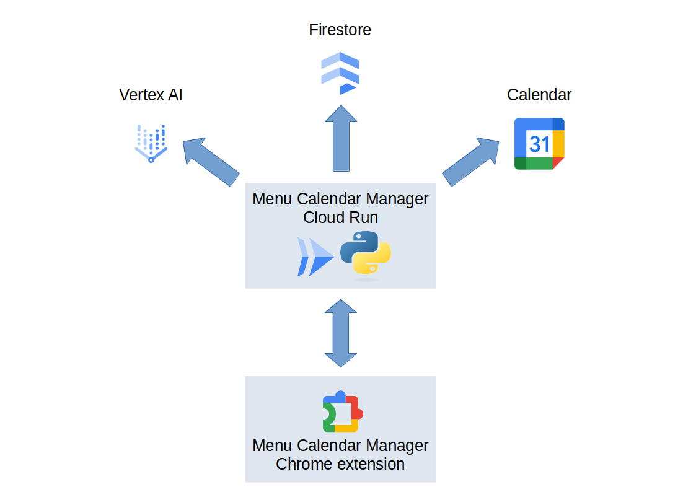

# Menu Calendar Manager

Menu Calendar Manager is a learning project that I used it to explore Google Cloud Platform.
It implements a smart planning tool designed to make home-cooked meals easier and more enjoyable. It allows users to pin their favorite online recipes directly to their Google Calendar, helping them stay organized and ensuring they always have meal ideas ready for the week. By automatically extracting ingredients from each recipe, the tool also simplifies grocery shopping: users can generate a complete shopping list for the week with just one click, 
It's made of a client side running as a Chrome extension and a server side implemented as a Cloud Run Function

# Repositories

The Chrome extension on the client side can be found here: https://github.com/sergio-panseri/menu-calendar-manager-chrome-extension

The server side python code can be found here: https://github.com/sergio-panseri/menu-calendar-manager-python

# Chrome extension

When the user is visiting a page with a recipe they like, they can use the chrome extension to submit it to their calendar, specifying the starting date and the frequency.

The chrome extension can also be used to extract the consolidated ingredient list for the selected days.

# Server side

On the server side Cloud Run is receiving the requests from the chrome extension and communicating with Vertex AI for ingredient extraction, Firestore database to store the ingredients for each recipe and Google Calendar to save the favourite recipes as ingredients

# Google Calendar

The final piece is the standard google calendar that the user can access via web or the standard google mobile application. As they added their favorite recipes to the calendar, they set a preferred frequency for each dish. Each week then the calendar will display a suggested selection of meals, offering inspiration at a glance. Users can review the automatically generated plan, adjust it as needed, and finalize their cooking schedule.
